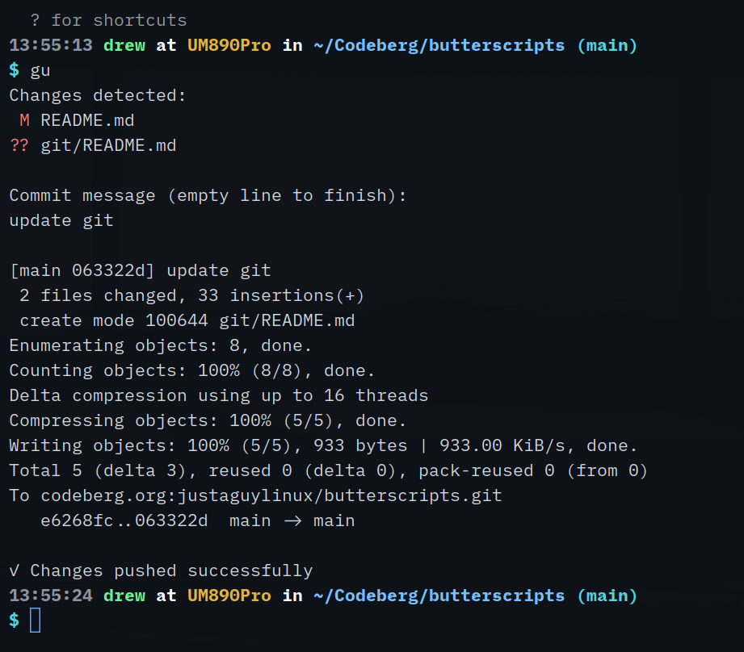

# Git Scripts

Git workflow utilities and setup guides.

## Scripts

### gitup
Quick commit and push workflow script.

```bash
./gitup
```

Checks for changes, prompts for a commit message, then runs `git add -A && git commit && git push` in one go.

### git-notes-status.sh
Background monitoring script that checks a notes repository and sends desktop notifications about git status (commits ahead/behind).

Monitors: `$HOME/git.thelinuxcast.org/notes`

## Documentation

### CODEBERG_SSH_SETUP.md
Step-by-step guide for setting up SSH authentication with Codeberg.

## Screenshots


